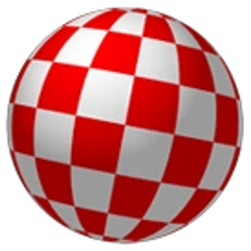

<h1> Updated Adobe Alternatives </h1>

This list has been taken from [KenneyNL](https://github.com/KenneyNL) on GitHub and [@XdanielArt](https://x.com/XdanielArt) on X. The purpose of copying and updating this repo is to save the record and update any information in case the following repo was lost.

[You may find the original screenshotted repo here in case it mysteriously gets deleted off the internet. Not likely to happen at all, but eh.](https://web.archive.org/web/20250407014806/https://github.com/KenneyNL/Adobe-Alternatives)

You may also read the original README.md [here](https://codeberg.org/koeame/adobe-alternatives-ko/src/branch/main/resources/copies). If you want a read-only version of this repo, you can find it [here]() (WIP).

Credit goes to KenneyNL, XdanielArt, and their contributors for assembling and updating the list. I (ko) am just making it look pretty and adding more to the list. Like the original repo, feel free to open issues, pull requests, and/or make images for easier sharing.

**DISCLAIMER: Some of the software listed may no longer have support or are possibly broken, obsolete, or deprecated. There are marks in these lists of software for any specific instructions, support, or caution.**

__ORIGINAL DESCRIPTION__:

> A list of alternatives for Adobe software, originally collected by [@XdanielArt](https://x.com/XdanielArt) and improved upon by the community. Feel free to open issues or pull requests, or create an image (for easy sharing) out of the data. The lists are always ordered with the free & open source option on top, but it might not be the best alternative depending on your use case.

**Legend:**

- ✨ = Free and open-source
- ⭐️ = Free of charge
- 💵 = Single purchase
- 🔒 = Subscription for more functions
- **AI** = Programs using full-fledged AI-Generation (not features!)

**Platforms:**

-  - Windows
-  - Mac
-  - Linux
-  - iOS (Mobile)
-  - Android (Mobile)
-  - Browser __*__
-  - Steam __**__
-  - Raspberry Pi
-  - AmigaOS
> __*__ does not specify which exact browsers are tested

> __**__ Steam support does not always indicate full, stable support on operating systems such as Linux. [ProtonDB](https://www.protondb.com/explore) unfortunately doesn't list software in the database, so the only thing you can refer to is their official websites. [WINE](https://www.winehq.org/) is better suited for running software from Linux. 

**Alternatives to:**

- [Photoshop](https://codeberg.org/koeame/adobe-alternatives-ko/src/branch/main#photoshop)
- [Illustrator](https://codeberg.org/koeame/adobe-alternatives-ko/src/branch/main#illustrator)
- [Animate](https://codeberg.org/koeame/adobe-alternatives-ko/src/branch/main#indesign)
- [InDesign](https://codeberg.org/koeame/adobe-alternatives-ko/src/branch/main#indesign)
- [Substance](https://codeberg.org/koeame/adobe-alternatives-ko/src/branch/main#substance)
- [Lightroom](https://codeberg.org/koeame/adobe-alternatives-ko/src/branch/main#lightroom)
- [XD](https://codeberg.org/koeame/adobe-alternatives-ko/src/branch/main#xd)
- [Premiere](https://codeberg.org/koeame/adobe-alternatives-ko/src/branch/main#premiere)
- [Acrobat](https://codeberg.org/koeame/adobe-alternatives-ko/src/branch/main#acrobat)
- [Bridge](https://codeberg.org/koeame/adobe-alternatives-ko/src/branch/main#bridge)
- [Dreamweaver](https://codeberg.org/koeame/adobe-alternatives-ko/src/branch/main#dreamweaver)
- [Audition](https://codeberg.org/koeame/adobe-alternatives-ko/src/branch/main#audition)
- [After Effects](https://codeberg.org/koeame/adobe-alternatives-ko/src/branch/main#after-effects)

## Photoshop

### Photography

- ✨ [GIMP](https://www.gimp.org) (* Windows,  Mac,  Linux)*
- ⭐️ [💵, 🔒] [Sumo Paint](https://sumo.app) (* Windows,  Mac,  Linux,  Browser)*
- ⭐️ [💵] [Photopea](https://www.photopea.com) *( Browser)*
- ⭐️ [Paint.NET](https://www.getpaint.net) *( Windows)*
- ⭐️ [🔒, **AI** ] [Pixlr](https://pixlr.com) *( Browser)*
- 💵 [Pixelmator Pro](https://www.pixelmator.com/pro) *( Mac)*
- 💵 [PaintShop Pro](https://www.paintshoppro.com) *( Windows)*
- 💵 [Affinity Photo](https://affinity.serif.com/en-gb/photo) (* Windows,  Mac,  iOS)*
- 💵 [Photoline](https://www.pl32.com) (* Windows,  Mac)*
- 💵 [Acorn](https://flyingmeat.com/acorn) *( Mac)*

### Painting

- ✨ [Krita](https://krita.org) *( Windows,  Mac,  Linux,   Android)*
- ✨ [MyPaint](https://mypaint.app) *( Windows,  Mac,  Linux)*
- ⭐️ [IbisPaint](https://ibispaint.com) *( Windows,  Android,  iOS)*
- ⭐️ [💵] [Sketchbook](https://www.sketchbook.com) *( Windows,  Mac,  Android,  iOS)*
- ⭐️ [Microsoft Paint](https://apps.microsoft.com/store/detail/paint/9PCFS5B6T72H) *( Windows)*
- ⭐️ [FireAlpaca](https://firealpaca.com) *( Windows,  Mac,  Linux)*
- ⭐️ [Medibang](https://medibangpaint.com) *( Windows,  Mac,  Android,  iOS,  Steam)*
- 💵 [Paintstorm](https://paintstormstudio.com/index.html) *( Windows,  Mac,  Linux,  iOS)*
- 💵 [Corel Painter](https://www.painterartist.com) *( Windows [1] ,  Mac)*
- 💵 [Rebelle](https://www.escapemotions.com/products/rebelle) *( Windows,  Mac)*
- 💵 [🔒] [Clip Studio Paint](https://www.clipstudio.net)  *( Windows,  Mac,  Android,  iOS)*
- 💵 [PaintTool SAI](https://www.systemax.jp/en/sai) *( Windows)*
- 💵 [Procreate](https://procreate.com) *( iOS)*
- 💵 [Artstudio Pro](https://apps.apple.com/us/app/artstudio-pro/id1244142051) *( iOS)*
- 💵 [Infinite Studio](https://www.infinitestudio.art) *( Android,  iOS)*
- 💵 [Realistic Paint Studio](https://realisticpaint.com) *( Windows,  Mac,  iOS)*
- 💵 [ArtRage](https://www.artrage.com/artrage) *( Windows,  Mac,  Android,  iOS)*
- 💵 [BlackInk](https://store.steampowered.com/app/233680/Black_Ink/) [Ink](https://blackink.bleank.com/)  *( Windows,  Steam)*

> __1__ - The newest version of Corel Painter (2023) doesn't support Windows anymore as of April 2025.

### Pixel art

- ✨ [💵] [Aseprite](https://www.aseprite.org) *( Windows,  Mac,  Linux)*
- ✨ [Pixelorama](https://orama-interactive.itch.io/pixelorama) *( Browser,  Windows,  Mac,  Linux,  Raspberry Pi [1] )*
- ✨ [PixiEditor](https://pixieditor.net) *( Windows,  Steam)*
- ✨ [LibreSprite](https://libresprite.github.io) *( Windows,  Mac,  Linux)*
- ✨ [GrafX2](http://grafx2.chez.com) *( Windows,  Mac,  Linux,  AmigaOS, 🍁
 Haiku,  Android)* [2]
- ✨ [Pixilart](https://www.pixilart.com/draw) *( Browser,  Android,  iOS)*
- ⭐️ [Lospec Pixel Editor](https://apps.lospec.com/pixel-editor) *( Browser)*
- ⭐️ [Pixel Studio](https://store.steampowered.com/app/1204050/Pixel_Studio__pixel_art_editor) *( Windows,  Mac,  Steam)*
- ⭐️ [ **AI** ][Microsoft Paint](https://apps.microsoft.com/store/detail/paint/9PCFS5B6T72H) *( Windows)*
- ⭐️ [GraphicsGale](https://graphicsgale.com)  *( Windows)*
- 💵 [Pro Motion NG](https://www.cosmigo.com) *( Windows)* [3]
- 💵 [Lightcube](https://www.lightcube.art) *( Windows)*
- 💵 [Pyxel Edit](https://pyxeledit.com) *( Windows,  Mac,  Linux)*
- 💵 [Pixquare](https://www.pixquare.art) *( Mac,  iOS)*

> __1__ - You can install Pixelorama on [snapcraft.io](https://snapcraft.io/install/pixelorama/raspbian) from Raspbian or on [pi-apps.io](https://pi-apps.io/install-app/install-pixelorama-on-raspberry-pi/).

> __2__ - GrafX2 is a portable pixel art editing software and has packages for most operating systems, even ones unsupported. Some of the platforms listed are by third-party distributors, in which developers claim they have little to no involvement.

> __3__ - Pro Motion NG suggests using Wine for Macintosh and Linux support. You can learn more about this [here](https://www.cosmigo.com/pixel_animation_software/downloads/mac_linux_downloads).

## Illustrator

### General

- ✨ [Inkscape](https://inkscape.org) *( Windows,  Mac,  Linux)* [1]
- ⭐️ [Boxy SVG](https://boxy-svg.com) *( Browser)*
- ⭐️ [🔒] [Linearity Curve](https://www.linearity.io/curve) *( Mac,  iOS)*
- 💵 [CorelDRAW](https://www.coreldraw.com) *( Windows,  Mac)*
- 💵 [Affinity Designer](https://affinity.serif.com) *( Windows,  Mac,  iOS)*
- 💵 [Xara Designer](https://www.xara.com/designerpro-plus) *( Windows)*
- 🔒 [Corel Vector](https://app.corelvector.com) *( Browser)*

> __1__ - Inkscape's stable version supports  Windows only.

### Live trace

- ✨ [SVGcode](https://svgco.de) *( Browser)*
- ✨ [VTracer](https://www.visioncortex.org/vtracer) *( Browser,  Windows,  Mac,  Linux)*
- ✨ [CR8tracer](https://cr8software.net/tracer.html) *( Windows)*
- 💵 [Vector Magic](https://vectormagic.com) *( Windows,  Mac)*

## Animate

### General

- ✨ [Tahoma2D](https://tahoma2d.org) *( Windows,  Mac,  Linux)*
- ✨ [Blender](https://www.blender.org) *( Windows,  Mac,  Linux,  Steam)*
- ✨ [OpenToonz](https://opentoonz.github.io/e) *( Windows,  Mac,  Linux)*
- ✨ [Wick Editor](https://www.wickeditor.com) *( Browser,  Windows,  Mac,  Linux,  iOS, [1] , Android [1] )*
- ✨ [Synfig](https://www.synfig.org) *( Windows,  Mac,  Linux)*
- ✨ [Glaxnimate](https://glaxnimate.mattbas.org) *( Windows,  Mac,  Linux)*
- ⭐️ [🔒] [Linearity Move](https://www.linearity.io/move) *( Mac,  iOS)*
- 💵 [CACANi](https://cacani.sg) *( Windows)*
- 💵 [TVPaint](https://tvpaint.com) *( Windows,  Mac,  Android [2] )*
- 💵 [Toon Boom](https://www.toonboom.com) *( Windows,  Mac,  Linux)*
- 💵 [Clip Studio Paint](https://www.clipstudio.net) *( Windows,  Mac,  Chromebook,  iOS,  Android)*
- 💵 [Moho](https://moho.lostmarble.com) *( Windows,  Mac)*
- 💵 [Tumult Hype](https://tumult.com/hype) *( Mac)*

> __1__ - Wick Editor writes that the software has support for iOS and Android, however by the time of writing this (April 10th, 2025), the pages are either 404'ed or are not up yet. For now, this footnote will remain until it gets fixed.

> __2__ - You must sign up on TVPaint to get an .apk of a testing version for Android mobile.

### Honorable mentions

- ✨ [Krita](https://krita.org) *( Windows,  Mac,  Linux,  Android)*
- ✨ [Pencil2D](https://www.pencil2d.org) *( Windows,  Mac,  Linux)*
- ⭐️ [FireAlpaca](https://firealpaca.com) *( Windows,  Mac,  Linux)*

## InDesign

- ✨ [Scribus](https://www.scribus.net) *( Windows,  Mac,  Linux)*
- ✨ [Laidout](https://laidout.org) *( Linux)*
- 💵 [Affinity Publisher](https://affinity.serif.com/en-gb/publisher) *( Windows,  Mac,  iOS)*
- 💵 [or 🔒, **AI** ] [QuarkXPress](https://www.quark.com/products/quarkxpress) *( Windows,  Mac)*

## Substance

### Designer

- ✨ [Material Maker](https://www.materialmaker.org) *( Windows,  Mac,  Linux)*
- ⭐️ [Quixel Mixer](https://quixel.com/mixer) *( Windows,  Mac)*
- ⭐️ [InstaMAT](https://instamaterial.com) *( Windows,  Mac)*

### Painter

- ✨ [ArmorPaint](https://armorpaint.org) *( Windows,  Mac,  Linux,  iOS,  Android)*
- ⭐️ [Quixel Mixer](https://quixel.com/mixer) *( Windows,  Mac)*
- 💵 [3DCoat](https://3dcoat.com) *( Windows,  Mac,  Linux)*
- 💵 [Marmoset Toolbag](https://marmoset.co/toolbag) *( Windows,  Mac,  Steam)*

## Lightroom

- ✨ [RawTherapee](https://www.rawtherapee.com) *( Windows,  Mac,  Linux)*
- ✨ [Darktable](https://www.darktable.org) *( Windows,  Mac,  Linux)*
- ✨ [digiKam](https://www.digikam.org) *( Windows,  Mac,  Linux)*
- 💵 [or 🔒] [Darkroom](https://darkroom.co) *( Mac,  iOS)*
- 💵 [ **AI** ] [On1 Photo RAW](https://www.on1.com) *( Windows,  Mac,  iOS,  Android)*
- 💵 [FastRawViewer](https://www.fastrawviewer.com) *( Windows,  Mac)*
- 💵 [Capture One](https://www.captureone.com) *( Windows,  Mac)*
- 💵 [Dx0 PhotoLab](https://www.dxo.com/dxo-photolab) *( Windows,  Mac)*
- 💵 [ **AI**  ] [Luminar Neo](https://skylum.com/luminar) *( Windows,  Mac)*
- 💵 [ **AI**  ] [Aurora HDR](https://skylum.com/aurora-photo-editor) *( Windows,  Mac,  iOS,  Android)*

## XD

- ✨ [Penpot](https://penpot.app) *( Windows [1],  Mac [1],  Linux [1])*
- ✨ [Draftoola](https://github.com/nitramr/Draftoola) *( Linux)*
- ⭐️ [Lunacy](https://icons8.com/lunacy) *( Windows,  Mac,  Linux)*
- ⭐️ [🔒] [Figma](https://www.figma.com)  *( Browser,  Windows,  Mac,   iOS,  Android)*
- 💵 [Sketch](https://www.sketch.com) *( Mac)*
- 💵 [Origami Studio](https://origami.design) *( Mac)*
- 💵 [Axure RP](https://www.axure.com) *( Windows,  Mac)*
- 💵 [Principle](https://principleformac.com) *( Mac)*
- 🔒 [ **AI**  ] [Framer](https://www.framer.com) *( Windows,  Mac,  Linux)* [2]

> __1__ - Penpot is available on self-hosting virtual containers like [Elestio](https://elest.io/) and [Docker](https://docs.docker.com/desktop/).

> __2__ - It is likely that Framer supports mobile versions, but as of writing this footnote (July 3rd, 2025), there are no pages available for the Apple Store and Google Play. 

## Premiere

- ✨ [Olive](https://olivevideoeditor.org) *( Windows,  Mac,  Linux)* [1]
- ✨ [Kdenlive](https://kdenlive.org) *( Windows,  Mac,  Linux)*
- ✨ [OpenShot](https://www.openshot.org) *( Windows,  Mac,  Linux)*
- ✨ [Shotcut](https://www.shotcut.org) *( Windows,  Mac,  Linux)*
- ⭐️ [💵] [DaVinci Resolve](https://www.blackmagicdesign.com/products/davinciresolve) *( Windows,  Mac,  Linux)*
- 💵 [or 🔒] [VEGAS Pro](https://www.vegascreativesoftware.com/us/vegas-pro) *( Windows)*
- 💵 [Final Cut Pro](https://www.apple.com/final-cut-pro) *( Mac,  iOS)*
- 🔒 [ **AI**  ] [Kapwing](https://www.kapwing.com) *( Browser)*
- 🔒 [ **AI**  ] [CapCut](https://www.capcut.com) *( Browser,  Windows,  iOS,  Android)*

> __1__ - As of writing (July 3rd, 2025), new downloads for Olive are unavailable for the moment. This footnote will be removed once their website is up again.

## Acrobat

### Editor

- ✨ [LibreOffice Draw](https://www.libreoffice.org) *( Windows,  Mac,  Linux)*
- ⭐️ [PDF24](https://www.pdf24.org) *( Windows)*
- ⭐️ [💵, 🔒] [Obsidian](https://obsidian.md/) *( Windows,  Mac,  Linux,  iOS,  Android)*
- 💵 [PDF-XChange](https://pdf-xchange.eu/pdf-xchange-editor) *( Windows)*
- 🔒 [Xodo](https://xodo.com) *( Browser,  Windows,  Mac,  Linux,  iOS,  Android)*

### Reader

- ✨ [Zathura](https://pwmt.org/projects/zathura) *( Linux*)
- ✨ [Sioyek](https://sioyek.info) *( Windows,  Mac,  Linux)*
- ✨ [Sumatra PDF](https://www.sumatrapdfreader.org/free-pdf-reader) *( Windows)*
- ⭐️ [💵, 🔒] [Obsidian](https://obsidian.md/) *( Windows,  Mac,  Linux,  iOS,  Android)*

## Bridge

- ⭐️ [XnView MP](https://www.xnview.com/en/xnviewmp) *( Windows,  Mac,  Linux)*
- 🔒 [Anchorpoint](https://www.anchorpoint.app) *( Windows,  Mac)*

## Dreamweaver

- ✨ [Netbeans](https://netbeans.apache.org) *( Windows,  Mac,  Linux)*
- ✨ [VSCodium](https://vscodium.com) *( Windows,  Mac,  Linux)*
- ⭐️ [ **AI** ] [Visual Studio Code](https://code.visualstudio.com) *( Windows,  Mac,  Linux)*
- ⭐️ [PageFabric](https://apps.microsoft.com/detail/9p170799pf3q?hl=en-US&gl=US) *( Windows)* 1
- 💵 [🔒] [Nova](https://nova.app) *( Mac)*
- 🔒 [ **AI** ] [WebStorm](https://www.jetbrains.com/webstorm) *( Windows,  Mac,  Linux)*
- 🔒 [ **AI** ] [PHPStorm](https://www.jetbrains.com/phpstorm) *( Windows,  Mac,  Linux)*

> __1__ - PageFabric's website is down, so for now (July 3rd, 2025) it will use the Microsoft store page.

## Audition

### General

- ✨ [Audacity](https://www.audacityteam.org) *( Windows,  Mac,  Linux)*
- ⭐️ [Ocenaudio](https://www.ocenaudio.com) *( Windows,  Mac,  Linux)*
- ⭐️ [💵] [DaVinci Resolve Fairlight](https://www.blackmagicdesign.com/nl/products/davinciresolve/fairlight) *( Windows,  Mac,  Linux)*
- 💵 [GoldWave](http://www.goldwave.com) *( Browser,  Windows,  Mac,  Linux,  iOS,  Android)* [1]
- 💵 [iZotope RX](https://www.izotope.com/en/shop/rx.html) *( Windows,  Mac)*
- 💵 [Sound Forge](https://www.magix.com/au/music/sound-forge) *( Windows)* [2]

> __1__ - Goldwave uses a multiplatform variant that can run most platforms like browsers and OSes.

> __2__ - Sound Forge has discontinued MacOS support. [Read more here.](https://www.magix.com/us/music-editing/sound-forge/sound-forge-pro-mac/)

### DAWs

- ✨ [💵, 🔒] [Ardour](https://ardour.org) *( Windows,  Mac,  Linux)*
- ✨ [LMMS](https://lmms.io) *( Windows,  Mac,  Linux)*
- ⭐️ [Cakewalk](https://www.bandlab.com/products/cakewalk)  *( Windows,  Mac)*
- ⭐️ [GarageBand](https://www.apple.com/mac/garageband) *( Mac)*
- ⭐️ [💵] [Tracktion Waveform](https://www.tracktion.com/products/waveform-free) *( Windows,  Mac,  Linux,  Raspberry Pi)*
- ⭐️ [🔒] [Pro Tools](https://www.avid.com/pro-tools) *( Windows,  Mac)*
- 💵 [Reaper](https://www.reaper.fm) *( Windows,  Mac,  Linux)*
- 💵 [Logic Pro](https://www.apple.com/logic-pro) *( Mac,  iOS)*
- 💵 [Ableton Live](https://www.ableton.com/en/live) *( Windows,  Mac)*
- 💵 [FL Studio](https://www.image-line.com/fl-studio) *( Windows,  Mac)*
- 💵 [FL Studio Mobile](https://www.image-line.com/fl-studio-mobile) *( Browser,  Windows,  Mac,  Linux,  iOS,  Android)*
- 💵 [Bitwig](https://www.bitwig.com) *( Windows,  Mac,  Linux)*
- 💵 [Steinberg Wavelab](https://www.steinberg.net/wavelab) *( Windows,  Mac)*
- 💵 [Steinberg Cubase](https://www.steinberg.net/cubase) *( Windows,  Mac)*
- 💵 [Steinberg Nuendo](https://www.steinberg.net/nuendo) *( Windows,  Mac)*
- 🔒 [Studio One](https://www.presonus.com/en-US/studio-one.html) *( Windows,  Mac,  Linux)*
- 🔒 [Cakewalk Next](https://www.cakewalk.com/next) *( Windows)*
- 🔒 [Cakewalk Sonar](https://www.cakewalk.com/sonar) *( Windows)*

## After Effects

### Compositing and effects

- ✨ [Natron](https://natrongithub.github.io) *( Windows,  Mac,  Linux)*
- ✨ [Blender](https://www.blender.org) *( Windows,  Mac,  Linux,  Steam)*
- ⭐️ [💵] [DaVinci Resolve Fusion](https://www.blackmagicdesign.com/nl/products/davinciresolve/fusion) *( Windows,  Mac,  Linux)*
- ⭐️ [💵] [ **AI** ] [Artlist](https://artlist.io/) [1] *( Windows,  Mac,  Linux)*
- 💵 [VEGAS Effects](https://www.vegascreativesoftware.com/au/vegas-post) *( Windows)*
- ⭐️ [Unreal Engine](https://www.unrealengine.com) (Motion Graphics Tools) *( Windows,  Mac,  Linux)*

> __1__ - For those who might ask about Hitfilm, the software was since discontinued and was bought out by Artlist. It has been said that Artlist might be broken for some users. [You can read more here.](https://www.reddit.com/r/Hitfilm/comments/1d4sq6d/psa_hitfilm_is_a_dead_software_information_and/)

### Motion graphics

- ✨ [Blender](https://www.blender.org) *( Windows,  Mac,  Linux)*
- ✨ [Friction](https://friction.graphics)  *( Windows,  Mac,  Linux)*
- ✨ [AstroFox](https://astrofox.io) *( Windows,  Mac,  Linux)*
- ⭐️ [🔒] Fable (https://www.fable.app) [1] *( Browser)*
- ⭐️ [🔒] [Linearity Move](https://www.linearity.io/move) *( Mac,  iOS)*
- 💵 [Final Cut Pro (Motion)](https://www.apple.com/final-cut-pro/motion) *( Mac)*
- 🔒 [Cavalry](https://cavalry.scenegroup.co) *( Windows,  Mac)*
- 🔒 [Rive](https://rive.app) *( Browser,  Windows,  Mac)*
- 🔒 [Jitter](https://jitter.video) *( Browser)*

>__1__ - [Fable has been completely discontinued.](https://x.com/fable_motion/status/1846220570377257040)

# XdanielArt's Image

